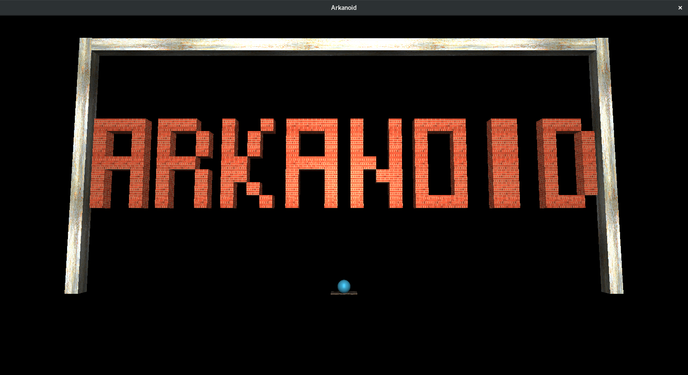

# OpenGL Arcanoid



## Compilation
```shell
make
```

## Running
```shell
./main_file
```

## Running on a machine with Nvidia Optimus card
First go through the pain of getting [bumblebee](https://bumblebee-project.org/) to work, then run
```shell
optirun ./main_file
```

---

Developed on and for Debian 9.4. Might work on Windows, definitely doesn't work on macOS.

